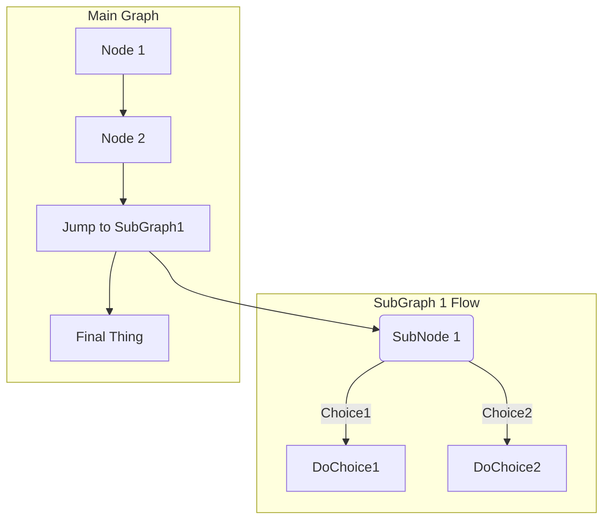

Markdown 是一种轻量级标记语言，排版语法简洁，让人们更多地关注内容本身而非排版。它使用易读易写的纯文本格式编写文档，可与 HTML 混编，可导出 HTML、PDF 以及本身的 .md 格式的文件。因简洁、高效、易读、易写，Markdown 被大量使用。

## Reference

- [基本语法](https://www.markdownguide.org/basic-syntax/)
- [mermaid 在线编辑器](https://mermaid-js.github.io/mermaid-live-editor/)
- [Markdown 高级技巧](https://www.runoob.com/markdown/md-advance.html)

# 绘图

## 流程图

### 案例

先看两个简单的例子

:::: details 案例 1


::: details Code

````

````

:::

::::

:::: details 案例 2



::: details Code

````

````

:::

::::

### 字母表示

- `TB` 从上到下
- `BT` 从下到上
- `LR` 从左到右
- `RL` 从右到左

### 图形

- `id[文字]` 矩形节点
- `id(文字)` 圆角矩形节点
- `id((文字))` 圆形节点
- `id{文字}` 菱形节点
- `id>文字]` 右向旗帜节点

### 箭头

- `---` 虚线
- `-.-` 实线
- `-->` 有箭头
- `-.->` 无箭头
- `--文字-->` 有文字
- `-.文字.->` 有文字

## 甘特图

## Reference

- [Mermaid](https://mermaid-js.github.io/mermaid)
