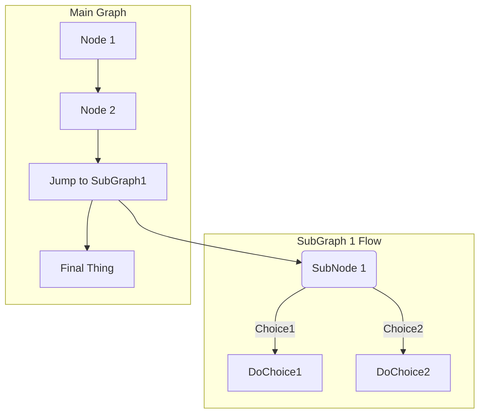

<!-- Description. -->

<!-- more -->

## Basic Syntax[^basic-syntax]

### horizontal-rules

**Input**

```text
***

---

_________________
```

<br>

**Output**

***

### [Mermaid](https://mermaid-js.github.io/mermaid/#/)

**流程图**

先看两个简单的例子

~~~

~~~


~~~

~~~


| 字母表示 | 含义 |
| :-: | :-: |
| TB | 从上到下 |
| BT | 从下到上 |
| LR | 从左到右 |
| RL | 从右到左 |

| 表述 | 说明 | 含义 |
| :-: | :-: | :-: |
| id[文字] | 矩形节点 | 表示过程 |
| id(文字) | 圆角矩形节点 | 表示开始与结束 |
| id((文字)) | 圆形节点 | 表示连接。为避免流程过长或有交叉，可将流程切开成对 |
| id{文字} | 菱形节点 | 表示判断、决策 |
| id>文字] | 右向旗帜节点 | |

| 箭头 | 含义 |
| :-: | :-: |
| --- | 虚线 |
| -.- | 实线 |
| --> | 有箭头 |
| -.-> | 无箭头 |
| --文字--> | 有文字 |
| -.文字.-> | 有文字 |

- [mermaid-live-editor](https://mermaid-js.github.io/mermaid-live-editor/)
- https://www.jianshu.com/p/77cc07f47cdc

## VuePress's Syntax Extensions[^VuePress]

### Emoji

You can add emoji to your Markdown content by typing :EMOJICODE:.

For a full list of available emoji and codes, check out emoji-cheat-sheet.

**Input**

```text
VuePress 2 is out :tada: !
```

**Output**

VuePress 2 is out :tada: !

### Code Blocks

#### Line Highlighting

You can highlight specified lines of your code blocks by adding line ranges mark in your fenced code blocks:

**Input**

~~~markdown
```js {1-2,4}
export default {
  data () {
    return {
      msg: 'Highlighted!'
    }
  }
}
```
~~~

**Output**

```js {1-2,4}
export default {
  data() {
    return {
      msg: 'Highlighted!'
    }
  }
}
```

Examples for line ranges mark:

- Line ranges: `{5-8}`
- Multiple single lines: `{4,7,9}`
- Combined: `{4,7-13,16,23-27,40}`

### Custom Containers

- Usage

```markdown
::: <type> [title]
[content]
:::
```

The `type` is required, and the `title` and `content` are optional.

Supported `type` :

- tip
- warning
- danger
- details
- Alias of CodeGroup and CodeGroupItem:
  - code-group
  - code-group-item

- Example

```markdown
::: tip
这是一个提示
:::

::: warning
这是一个警告
:::

::: danger 危险
这是一个危险警告
:::

::: details
这是一个详情块
:::
```

::: tip
这是一个提示
:::

::: warning
这是一个警告
:::

::: danger 危险
这是一个危险警告
:::

::: details
这是一个详情块
:::

::: link {Icon Name | Image URL} [title](url)
description
:::

::: link {/img/links/me.png} [My Blog](https://blog.zxh.io)
My blog 🧐, powered by VuePress 2, themed by Gungnir.
:::

## VuePress's Built-in Components[^Built-in-Components]

### Badge

- Props
  - type
    - Type: `'tip' | 'warning' | 'danger'`
    - Default: `'tip'`
  - text
    - Type: `string`
    - Default: `''`
  - vertical
    - Type: `'top' | 'middle' | 'bottom' | undefined`
    - Default: `undefined`

**Example**

**Input**

```markdown
- VuePress - <Badge type="tip" text="v2" vertical="top" />
- VuePress - <Badge type="warning" text="v2" vertical="middle" />
- VuePress - <Badge type="danger" text="v2" vertical="bottom" />
```

**Output**

- VuePress - <Badge type="tip" text="v2" vertical="top" />
- VuePress - <Badge type="warning" text="v2" vertical="middle" />
- VuePress - <Badge type="danger" text="v2" vertical="bottom" />

### CodeGroup

- Props
  - title
    - Type: `string`
    - Required: `true`
  - active
    - Type: `boolean`
    - Default: `false`
- Details:

  This component must be placed inside a CodeGroup component.

  Use the active prop to set the initial active item, or the first item will be activated by default.

**Example**

**Input**

~~~markdown
:::: code-group
::: code-group-item yarn

```bash:no-line-numbers
yarn
```

:::
::: code-group-item npm

```bash:no-line-numbers
npm install
```

:::
::::
~~~

**Output**

:::: code-group
::: code-group-item yarn

```bash:no-line-numbers
yarn
```

:::
::: code-group-item npm

```bash:no-line-numbers
npm install
```

:::
::::

## Gungnir's Markdown Syntax[^vuepress-theme-gungnir]

### Chart.js

Use JavaScript charting library [Chart.js](https://www.chartjs.org/) in Markdown via [plugin-chart](https://v2-vuepress-theme-gungnir.vercel.app/docs/plugins/chart/):

**Input**

~~~json
```chart
{
  "type": "doughnut",
  "data": {
  "datasets": [
    {
      "data": [10, 20, 30],
      "backgroundColor": [
        "rgba(255, 99, 132)",
        "rgba(255, 206, 86)",
        "rgba(54, 162, 235)"
      ]
    }
  ],
  "labels": ["Red", "Yellow", "Blue"]
  }
}
```
~~~

**Output**

```chart
{
  "type": "doughnut",
  "data": {
    "datasets": [{
      "data": [10, 20, 30],
      "backgroundColor": [
        "rgba(255, 99, 132)",
        "rgba(255, 206, 86)",
        "rgba(54, 162, 235)"
      ]
    }],
    "labels": ["Red", "Yellow", "Blue"]
  }
}
```

### Mark

Mark important information: "Excuse me. Can you tell me how much the shirt is?" "Yes, it's ===nine fifteen===."

```markdown
Yes, it's ==nine fifteen==.
```

## Reference

[^basic-syntax]: [Basic Syntax](https://www.markdownguide.org/basic-syntax/)
[^VuePress]: [VuePress](https://v2.vuepress.vuejs.org/guide/markdown.html#syntax-extensions)
[^Built-in-Components]: [VuePress's Built-in Components](https://v2.vuepress.vuejs.org/reference/default-theme/components.html#built-in-components)
[^vuepress-theme-gungnir]: [VuePress theme Gungnir](https://v2-vuepress-theme-gungnir.vercel.app/docs/basic/intro.html)
