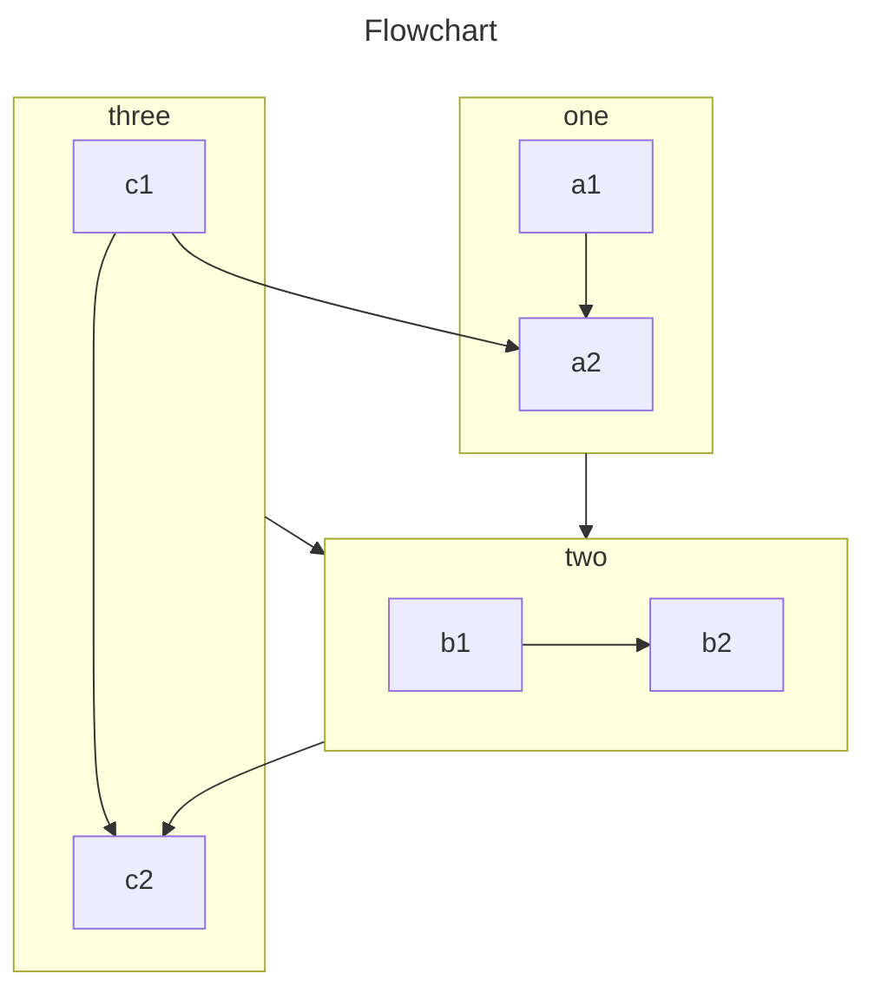

## Basic Syntax[^basic-syntax]

### horizontal-rules

**Input**

```text
***

---

_________________
```

<br>

**Output**

***

## VuePress's Syntax Extensions[^VuePress]

### Links

When using Markdown link syntax, VuePress will implement some conversions for you.

Take our documentation source files as an example:

```sh:no-line-numbers
└─ docs
   ├─ guide
   │  ├─ getting-started.md
   │  ├─ markdown.md    # <- Here we are
   │  └─ README.md
   ├─ reference
   │  └─ config.md
   └─ README.md
```

**Raw Markdown**

```markdown
<!-- relative path -->
[Home](../README.md)  
[Config Reference](../reference/config.md)  
[Getting Started](./getting-started.md)  
<!-- absolute path -->
[Guide](/guide/README.md)  
[Config Reference > markdown.links](/reference/config.md#links)  
<!-- URL -->
[GitHub](https://github.com)  
```

**Converted to**

```vue
<template>
  <RouterLink to="/">Home</RouterLink>
  <RouterLink to="/reference/config.html">Config Reference</RouterLink>
  <RouterLink to="/guide/getting-started.html">Getting Started</RouterLink>
  <RouterLink to="/guide/">Guide</RouterLink>
  <RouterLink to="/reference/config.html#links">Config Reference &gt; markdown.links</RouterLink>
  <a href="https://github.com" target="_blank" rel="noopener noreferrer">GitHub</a>
</template>
```

**Suggestion**

Try to use relative paths instead of absolute paths for internal links to markdown files.

- Relative paths are a valid links to the target files, and they can navigate correctly when browsing the source files in your editor or repository.
- Relative paths are consistent in different locales, so you don't need to change the locale path when translating your content.

### Emoji

You can add emoji to your Markdown content by typing :EMOJICODE:.

For a full list of available emoji and codes, check out emoji-cheat-sheet.

**Input**

```text
VuePress 2 is out :tada: !
```

**Output**

VuePress 2 is out :tada: !

### Code Blocks

#### Git diff

**Input**

~~~markdown
``` diff
diff --git a/filea.extension b/fileb.extension
index d28nd309d..b3nu834uj 111111
--- a/filea.extension
+++ b/fileb.extension
@@ -1,6 +1,6 @@
-oldLine
+newLine
```
~~~

**Output**

``` diff
diff --git a/filea.extension b/fileb.extension
index d28nd309d..b3nu834uj 111111
--- a/filea.extension
+++ b/fileb.extension
@@ -1,6 +1,6 @@
-oldLine
+newLine
```

#### Line Highlighting

You can highlight specified lines of your code blocks by adding line ranges mark in your fenced code blocks:

**Input**

~~~markdown
```js {1-2,4}
export default {
  data () {
    return {
      msg: 'Highlighted!'
    }
  }
}
```
~~~

**Output**

```js {1-2,4}
export default {
  data() {
    return {
      msg: 'Highlighted!'
    }
  }
}
```

Examples for line ranges mark:

- Line ranges: `{5-8}`
- Multiple single lines: `{4,7,9}`
- Combined: `{4,7-13,16,23-27,40}`

### Custom Containers

- Usage

```markdown
::: <type> [title]
[content]
:::
```

The `type` is required, and the `title` and `content` are optional.

Supported `type` :

- tip
- warning
- danger
- details
- Alias of CodeGroup and CodeGroupItem:
  - code-group
  - code-group-item

- Example

```markdown
::: tip
这是一个提示
:::

::: warning
这是一个警告
:::

::: danger 危险
这是一个危险警告
:::

::: details
这是一个详情块
:::

```

::: tip
这是一个提示
:::

::: warning
这是一个警告
:::

::: danger 危险
这是一个危险警告
:::

::: details
这是一个详情块
:::

## VuePress's Built-in Components[^Built-in-Components]

### Badge

- Props
  - type
    - Type: `'tip' | 'warning' | 'danger'`
    - Default: `'tip'`
  - text
    - Type: `string`
    - Default: `''`
  - vertical
    - Type: `'top' | 'middle' | 'bottom' | undefined`
    - Default: `undefined`

**Example**

**Input**

```markdown
- VuePress - <Badge type="tip" text="v2" vertical="top" />
- VuePress - <Badge type="warning" text="v2" vertical="middle" />
- VuePress - <Badge type="danger" text="v2" vertical="bottom" />
```

**Output**

- VuePress - <Badge type="tip" text="v2" vertical="top" />
- VuePress - <Badge type="warning" text="v2" vertical="middle" />
- VuePress - <Badge type="danger" text="v2" vertical="bottom" />

### Subscript

H~2~O

```markdown
H~2~O
```

### Superscript

29^th^

```markdown
29^th^
```

## Vuepress theme hope plugins[^vuepress-plugin-md-enhance]

### [选项卡](https://plugin-md-enhance.vuejs.press/zh/guide/tabs.html)

::: tabs#fruit

@tab apple

```
apple
```

@tab banana

Banana

@tab:active orange

<!-- tab orange 将会被默认激活 -->

Orange

:::

### [代码块分组](https://plugin-md-enhance.vuejs.press/zh/guide/code-tabs.html)

安装 VuePress Theme Hope:

::: code-tabs#shell

@tab pnpm

```bash
pnpm add -D vuepress-theme-hope@next
```

@tab yarn

```bash
yarn add -D vuepress-theme-hope@next
```

@tab:active npm

```bash
npm i -D vuepress-theme-hope@next
```

:::

安装 VuePress Plugin Markdown Enhance:

::: code-tabs#shell

@tab pnpm

```bash
pnpm add -D vuepress-plugin-md-enhance@next
```

@tab yarn

```bash
yarn add -D vuepress-plugin-md-enhance@next
```

@tab:active npm

```bash
npm i -D vuepress-plugin-md-enhance@next
```

:::

### [自定义对齐](https://plugin-md-enhance.vuejs.press/zh/guide/align.html)

:::: danger W.I.P
VuePress Theme Hope V2 版本仍在制作中，API 可能会有

::: center
重大的变动。
:::

如果你在使用过程中遇到了 bug，可以

::: right
[提一个 issue](https://github.com/vuepress-theme-hope/vuepress-theme-hope/issues)。
:::

::::

~~~md
:::: danger W.I.P
VuePress Theme Hope V2 版本仍在制作中，API 可能会有

::: center
重大的变动。
:::

如果你在使用过程中遇到了 bug，可以

::: right
[提一个 issue](https://github.com/vuepress-theme-hope/vuepress-theme-hope/issues)。
:::

::::
~~~

### [属性支持](https://plugin-md-enhance.vuejs.press/zh/guide/attrs.html)

可以使用特殊标记为 Markdown 元素添加属性。

### [脚注](https://plugin-md-enhance.vuejs.press/zh/guide/footnote.html)

- 在 Markdown 中使用 [^锚点文字] 来定义脚注。
- 在之后的任何位置使用 [^锚点文字]: ... 来描述脚注内容。

### [标记](https://plugin-md-enhance.vuejs.press/zh/guide/mark.html)

使用 == == 进行标记。请注意两边需要有空格。

Mark important information: "Excuse me. Can you tell me how much the shirt is?" "Yes, it's ==nine fifteen==."

```md
Yes, it's ==nine fifteen==.
```

### [任务列表](https://plugin-md-enhance.vuejs.press/zh/guide/tasklist.html)

- [ ] 计划 A
- [x] 计划 B

```md
- [ ] 计划 A
- [x] 计划 B
```

### [导入文件](https://plugin-md-enhance.vuejs.press/zh/guide/include.html)

`<!-- @include: https://github.com/golang/go/blob/master/README.md -->`

### [Chart](https://plugin-md-enhance.vuejs.press/zh/guide/chart.html)

#### 格式

~~~md
::: chart 标题

```json
{
  // 此处为图表配置
}
```

:::
~~~

#### 案例

::: chart 一个块状图案例

```json
{
  "type": "bar",
  "data": {
    "labels": ["红色", "蓝色", "黄色", "绿色", "紫色", "橙色"],
    "datasets": [
      {
        "label": "投票数",
        "data": [12, 19, 3, 5, 2, 3],
        "backgroundColor": [
          "rgba(255, 99, 132, 0.2)",
          "rgba(54, 162, 235, 0.2)",
          "rgba(255, 206, 86, 0.2)",
          "rgba(75, 192, 192, 0.2)",
          "rgba(153, 102, 255, 0.2)",
          "rgba(255, 159, 64, 0.2)"
        ],
        "borderColor": [
          "rgba(255, 99, 132, 1)",
          "rgba(54, 162, 235, 1)",
          "rgba(255, 206, 86, 1)",
          "rgba(75, 192, 192, 1)",
          "rgba(153, 102, 255, 1)",
          "rgba(255, 159, 64, 1)"
        ],
        "borderWidth": 1
      }
    ]
  },
  "options": {
    "scales": {
      "y": {
        "beginAtZero": true
      }
    }
  }
}
```

:::

:::: details 代码

~~~md
::: chart 一个块状图案例

```json
{
  "type": "bar",
  "data": {
    "labels": ["红色", "蓝色", "黄色", "绿色", "紫色", "橙色"],
    "datasets": [
      {
        "label": "投票数",
        "data": [12, 19, 3, 5, 2, 3],
        "backgroundColor": [
          "rgba(255, 99, 132, 0.2)",
          "rgba(54, 162, 235, 0.2)",
          "rgba(255, 206, 86, 0.2)",
          "rgba(75, 192, 192, 0.2)",
          "rgba(153, 102, 255, 0.2)",
          "rgba(255, 159, 64, 0.2)"
        ],
        "borderColor": [
          "rgba(255, 99, 132, 1)",
          "rgba(54, 162, 235, 1)",
          "rgba(255, 206, 86, 1)",
          "rgba(75, 192, 192, 1)",
          "rgba(153, 102, 255, 1)",
          "rgba(255, 159, 64, 1)"
        ],
        "borderWidth": 1
      }
    ]
  },
  "options": {
    "scales": {
      "y": {
        "beginAtZero": true
      }
    }
  }
}
```

:::
~~~

::::

### [ECharts](https://plugin-md-enhance.vuejs.press/zh/guide/echarts.html)

#### 格式

~~~md
::: echarts 标题

```json
{
  // 此处为 ECharts 图表配置
}
```

:::
~~~

::: echarts 一个折线图案例

```json
{
  "xAxis": {
    "type": "category",
    "data": ["Mon", "Tue", "Wed", "Thu", "Fri", "Sat", "Sun"]
  },
  "yAxis": {
    "type": "value"
  },
  "series": [
    {
      "data": [150, 230, 224, 218, 135, 147, 260],
      "type": "line"
    }
  ]
}
```

:::

#### 案例

:::: details 代码

~~~md
::: echarts 一个折线图案例

```json
{
  "xAxis": {
    "type": "category",
    "data": ["Mon", "Tue", "Wed", "Thu", "Fri", "Sat", "Sun"]
  },
  "yAxis": {
    "type": "value"
  },
  "series": [
    {
      "data": [150, 230, 224, 218, 135, 147, 260],
      "type": "line"
    }
  ]
}
```

:::
~~~

::::

### [流程图](https://plugin-md-enhance.vuejs.press/zh/guide/flowchart.html)

#### 语法

~~~md
```flow:preset

<!-- 放置你的流程图代码 -->

```
~~~

#### 案例

```flow
st=>start: 开始|past:>http://www.google.com[blank]
e=>end: 结束|future:>http://www.google.com
op1=>operation: 操作1|past
op2=>operation: 操作2|current
sub1=>subroutine: 子程序|invalid
cond=>condition: 是/否?|approved:>http://www.google.com
c2=>condition: 判断2|rejected
io=>inputoutput: 进行反思...|future

st->op1(right)->cond
cond(yes, right)->c2
cond(no)->sub1(left)->op1
c2(yes)->io->e
c2(no)->op2->e
```

::: details 代码

~~~md
```flow
st=>start: 开始|past:>http://www.google.com[blank]
e=>end: 结束|future:>http://www.google.com
op1=>operation: 操作1|past
op2=>operation: 操作2|current
sub1=>subroutine: 子程序|invalid
cond=>condition: 是/否?|approved:>http://www.google.com
c2=>condition: 判断2|rejected
io=>inputoutput: 进行反思...|future

st->op1(right)->cond
cond(yes, right)->c2
cond(no)->sub1(left)->op1
c2(yes)->io->e
c2(no)->op2->e
```
~~~

:::

### [Mermaid](https://plugin-md-enhance.vuejs.press/zh/guide/mermaid.html)

#### 语法

~~~md
```mermaid

<!-- 在此处放置 mermaid 代码 -->

```
~~~

#### 案例



::: details 代码

~~~md

~~~

:::

## Reference

[^basic-syntax]: [Basic Syntax](https://www.markdownguide.org/basic-syntax/)
[^VuePress]: [VuePress](https://v2.vuepress.vuejs.org/guide/markdown.html#syntax-extensions)
[^Built-in-Components]: [VuePress's Built-in Components](https://v2.vuepress.vuejs.org/reference/default-theme/components.html#built-in-components)
[^vuepress-plugin-md-enhance]: [VuePress plugin markdown 增强](https://plugin-md-enhance.vuejs.press/zh/)
