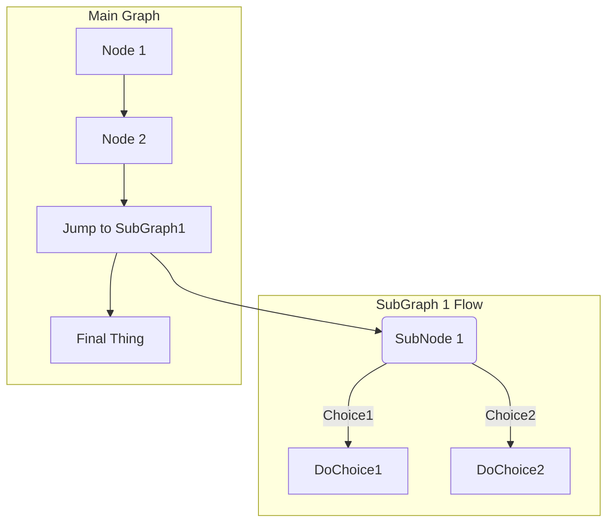

# 绘图

## 流程图

### 案例

先看两个简单的例子

:::: details 案例 1

::: details Code

~~~

~~~

:::

::::

:::: details 案例 2

::: details Code

~~~

~~~

:::

::::

### 字母表示

- `TB` 从上到下
- `BT` 从下到上
- `LR` 从左到右
- `RL` 从右到左

### 图形

- `id[文字]` 矩形节点
- `id(文字)` 圆角矩形节点
- `id((文字))` 圆形节点
- `id{文字}` 菱形节点
- `id>文字]` 右向旗帜节点

### 箭头

- `---` 虚线
- `-.-` 实线
- `-->` 有箭头
- `-.->` 无箭头
- `--文字-->` 有文字
- `-.文字.->` 有文字

## 甘特图

## Reference

- [Mermaid](https://mermaid-js.github.io/mermaid)